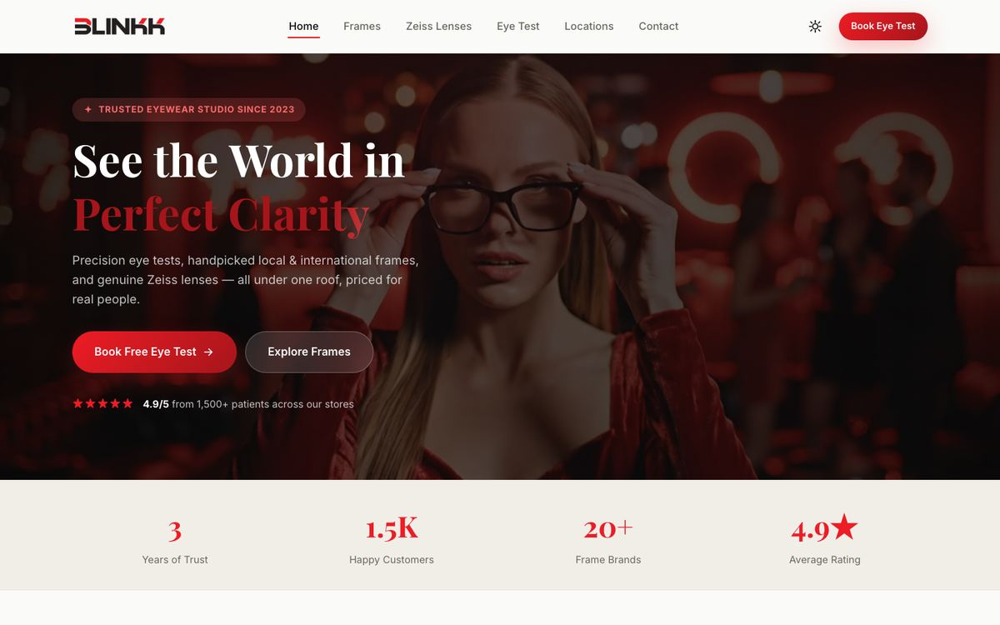
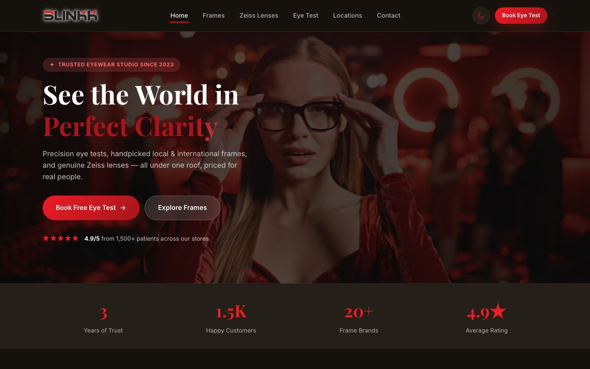
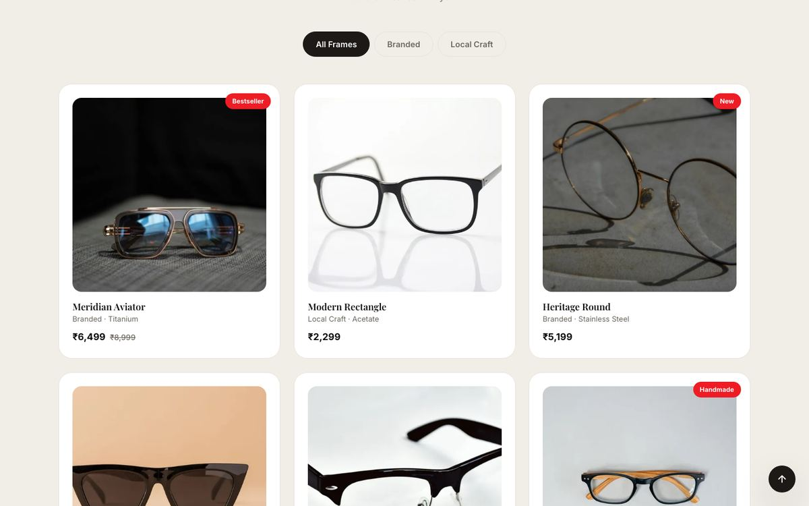
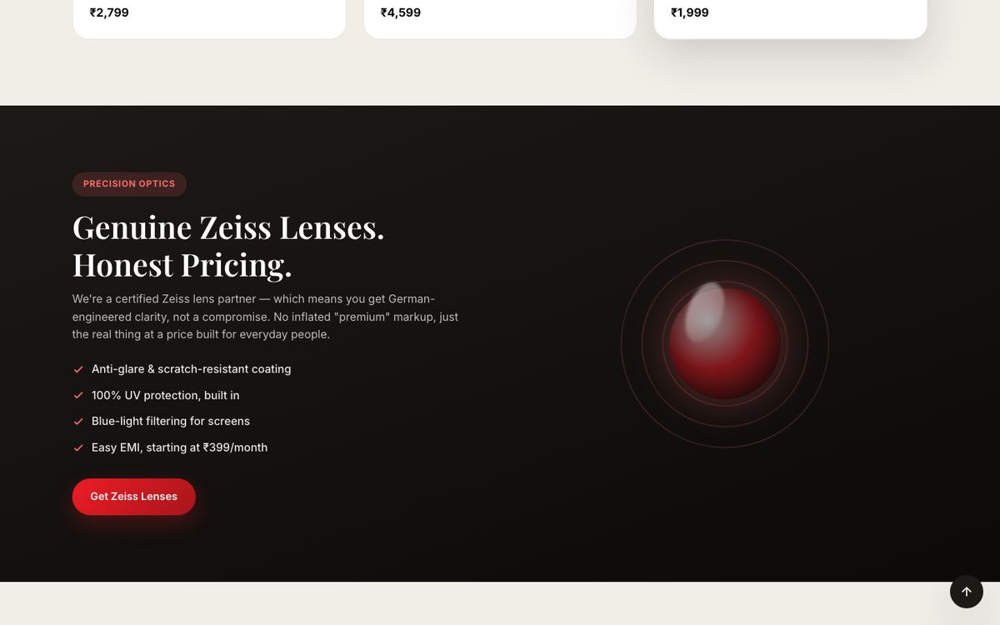
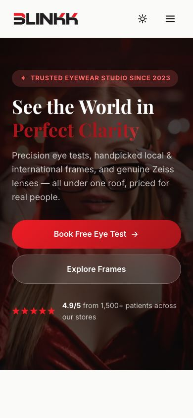

# Blinkk Opticals

Marketing website for Blinkk, an optical store chain (Rampurhat & Rajgram, West Bengal) offering eye tests, local & branded frames, and Zeiss lenses.

**Live site:** [https://blinkkopticalss.web.app/](https://blinkkopticalss.web.app/)

Static site — plain HTML/CSS/JS, no build step.

## Screenshots

| Hero (light) | Hero (dark) |
|---|---|
|  |  |

| Frames collection | Zeiss lenses |
|---|---|
|  |  |

| Mobile |
|---|
|  |

## Structure

- `index.html` — page markup
- `styles.css` — design system + styles
- `script.js` — interactions (nav, theme toggle, carousel, forms, animations)
- `assets/` — logo, product photography, hero video

## Run locally

```bash
python3 -m http.server 8080
```

Then open `http://localhost:8080`.
